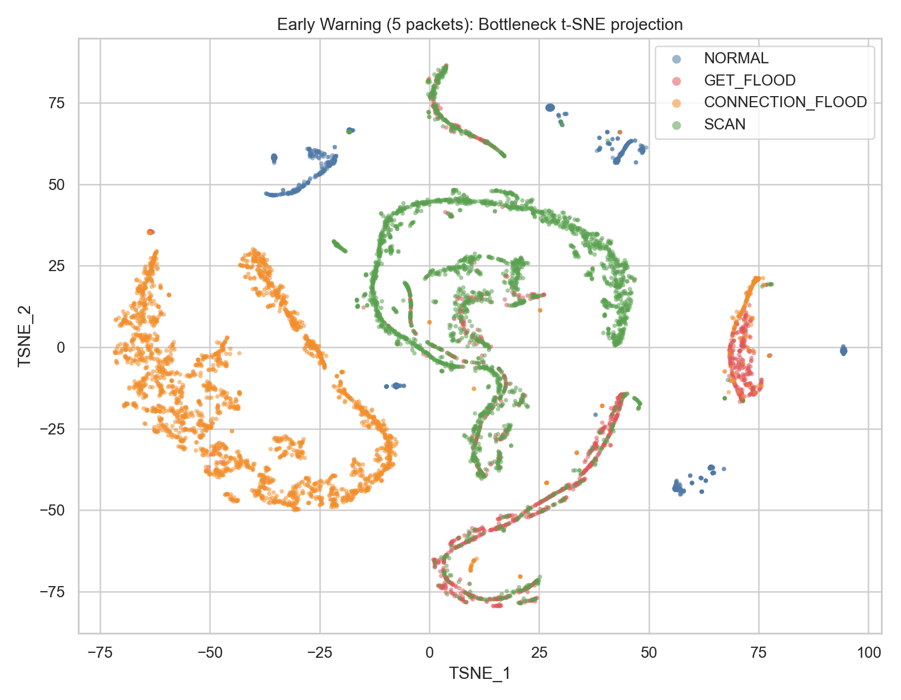
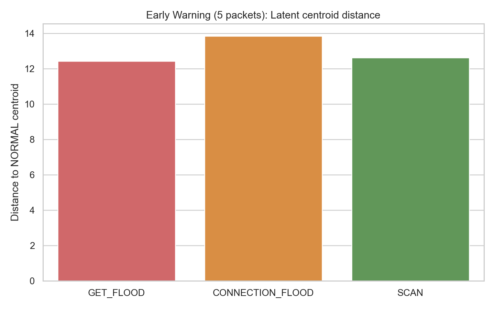
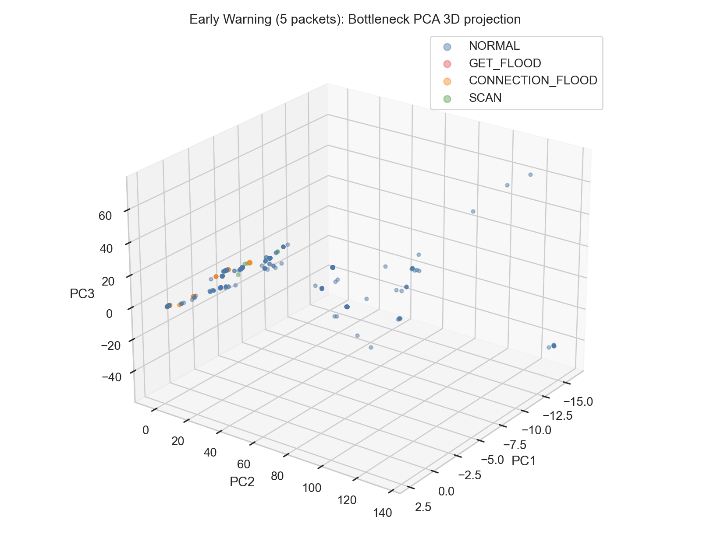
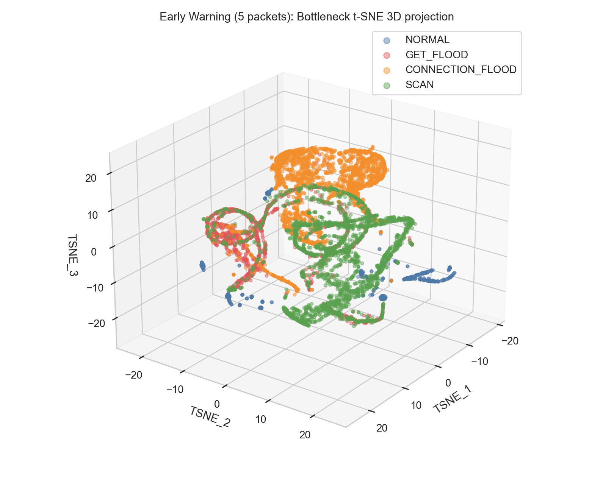
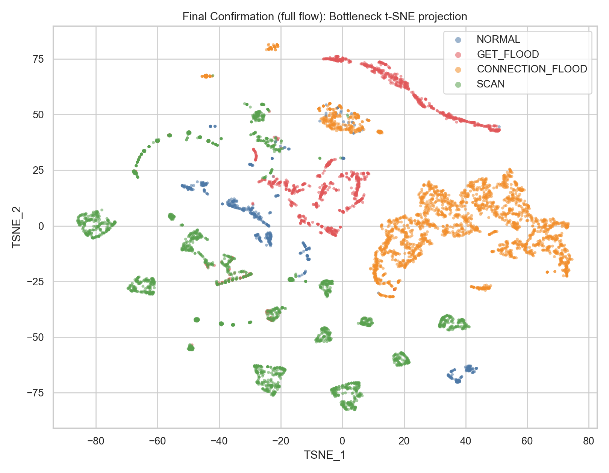
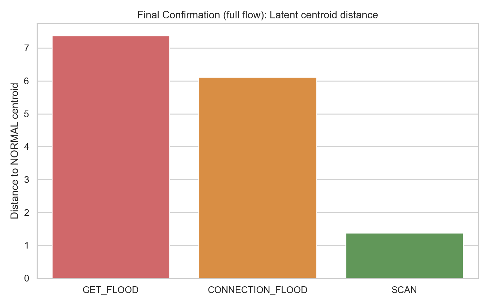
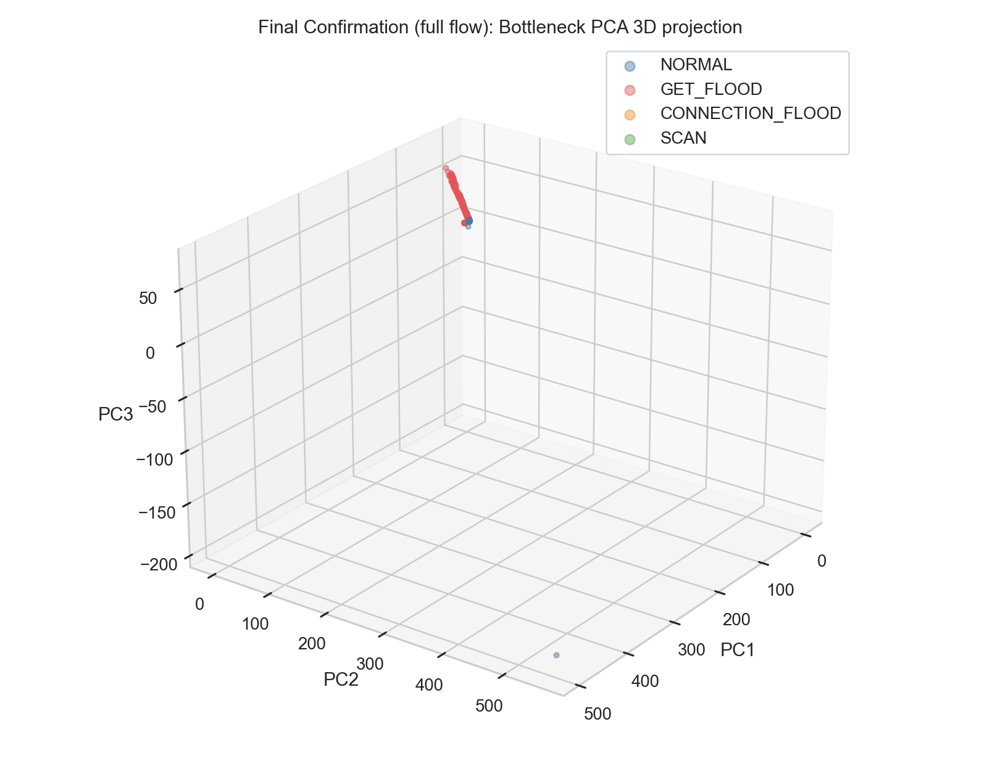
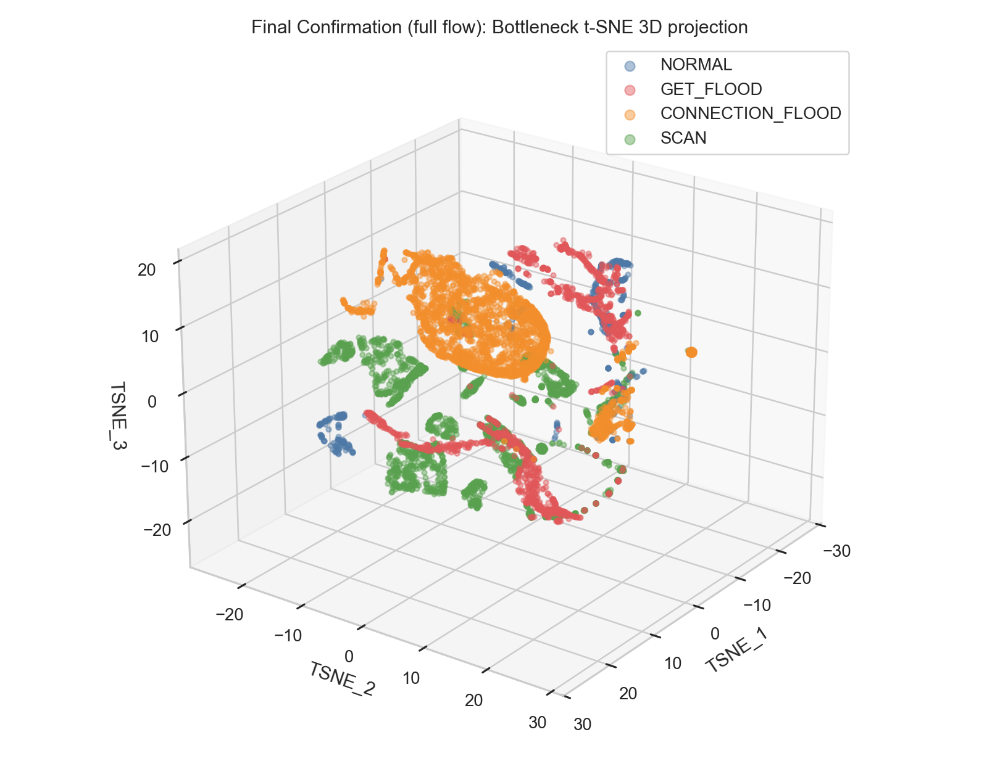

# Autoencoder 잠재공간 시각화

## 개요

이 문서는 anomaly benchmark에서 가장 성능이 좋았던 `Autoencoder`의 bottleneck 표현을 시각화한 결과다.
학습된 모델의 가운데 hidden layer(`24차원`)를 잠재공간으로 보고, held-out test split에서 정상/비정상 flow가 어떻게 배치되는지 확인했다.

## 방법

- 사용 모델: `prediction/anomaly_benchmark/autoencoder/{5,full}/artifact.pkl`
- 입력 데이터: anomaly benchmark의 test split
- 잠재벡터: `hidden_sizes=(96, 24, 96)` 중 가운데 `24차원` activation
- 전처리: artifact에 저장된 scaler 적용 후 잠재벡터를 다시 표준화
- 시각화:
  - PCA 2차원 투영: test 전체 row
  - PCA 3차원 투영: label당 최대 2,500개 샘플 균형 추출 후 `png + html` 저장
  - t-SNE 2차원 투영: label당 최대 2,500개 샘플 균형 추출
  - t-SNE 3차원 투영: 같은 균형 샘플 기준 `png + html` 저장

## 핵심 해석

- `5패킷` 잠재공간은 정상과 비정상이 비교적 또렷하게 갈린다. binary silhouette가 `0.7038`로 높고, 세 공격 모두 NORMAL centroid에서 멀리 떨어져 있다.
- `full` 잠재공간은 `GET_FLOOD`와 `CONNECTION_FLOOD`는 여전히 NORMAL과 분리되지만, `SCAN`은 NORMAL과 매우 가깝다. SCAN의 centroid distance가 `5패킷 12.6275`에서 `full 1.3703`로 크게 줄었다.
- `full`의 binary silhouette는 `-0.1546`로 낮다. 즉 전체 flow를 다 본다고 해서 bottleneck 공간이 더 깔끔한 군집을 만드는 것은 아니다.
- 이 결과는 기존 성능표에서 `5패킷 Autoencoder`가 이미 매우 강하고, `full` 단계에서 가장 어려운 공격이 `SCAN`이었던 점과 방향이 맞는다.
- 3D PCA/t-SNE를 보면 `5패킷`은 NORMAL 중심에서 공격군이 바깥으로 벌어지는 구조가 더 분명하고, `full`은 SCAN이 NORMAL 주변으로 다시 말려 들어오는 형태가 확인된다.

## 정량 지표

- `5패킷` PCA 설명분산: `PC1=0.4497`, `PC2=0.1965`
- `5패킷` PCA 3D 설명분산 누적: `0.7391`
- `5패킷` silhouette: multiclass `0.4470`, binary `0.7038`
- `full` PCA 설명분산: `PC1=0.6297`, `PC2=0.2162`
- `full` PCA 3D 설명분산 누적: `0.9938`
- `full` silhouette: multiclass `0.3474`, binary `-0.1546`

## 잠재공간을 더 선명하게 만드는 방법

- bottleneck 차원을 더 줄이는 것이 가장 먼저 볼 만하다. 현재 `24차원`은 복원에는 유리하지만 군집 분리에는 다소 넉넉해서, `8` 또는 `12` 차원으로 줄이면 NORMAL manifold가 더 조밀해질 가능성이 있다.
- denoising autoencoder나 dropout/L1 sparsity를 주면 입력의 작은 흔들림에 덜 민감한 latent를 만들 수 있다. 특히 `full` 단계처럼 분포가 섞이는 경우 local noise를 줄이는 데 도움이 된다.
- reconstruction loss만 쓰지 말고 latent center penalty를 같이 두는 것이 효과적이다. NORMAL latent를 하나의 중심 근처로 모으는 `center loss`나 `Deep SVDD`류 제약을 추가하면 군집 경계가 더 명확해진다.
- anomaly score를 복원오차 하나로만 두지 말고 latent distance까지 합치는 방법이 좋다. 예를 들면 NORMAL latent centroid에 대한 Mahalanobis distance를 같이 쓰면 `SCAN`처럼 경계에 붙는 샘플을 더 잘 밀어낼 수 있다.
- `full` 단계는 aggregate feature가 SCAN의 초기 구조를 희석하는 것이 문제로 보인다. 이 경우 모델보다 입력을 바꾸는 쪽이 더 효과적이라서, packet size/direction/IAT sequence를 직접 넣는 sequence autoencoder가 다음 우선순위다.

### NORMAL centroid 거리

|   stage | label            |   distance_to_normal |
|--------:|:-----------------|---------------------:|
|       5 | GET_FLOOD        |              12.4369 |
|       5 | CONNECTION_FLOOD |              13.8504 |
|       5 | SCAN             |              12.6275 |

| stage   | label            |   distance_to_normal |
|:--------|:-----------------|---------------------:|
| full    | GET_FLOOD        |              7.37968 |
| full    | CONNECTION_FLOOD |              6.11388 |
| full    | SCAN             |              1.37026 |

## 시각화

### 5패킷 잠재공간

[5패킷 PCA 3D HTML](../prediction/anomaly_benchmark/autoencoder/5/latent_pca_3d.html)

[5패킷 t-SNE 3D HTML](../prediction/anomaly_benchmark/autoencoder/5/latent_tsne_3d.html)

### 전체 flow 잠재공간

[full PCA 3D HTML](../prediction/anomaly_benchmark/autoencoder/full/latent_pca_3d.html)

[full t-SNE 3D HTML](../prediction/anomaly_benchmark/autoencoder/full/latent_tsne_3d.html)

## 산출물

- `prediction/anomaly_benchmark/autoencoder/5/latent_embedding_test.csv`
- `prediction/anomaly_benchmark/autoencoder/5/latent_projection_pca.csv`
- `prediction/anomaly_benchmark/autoencoder/5/latent_projection_pca3d.csv`
- `prediction/anomaly_benchmark/autoencoder/5/latent_projection_pca3d_sample.csv`
- `prediction/anomaly_benchmark/autoencoder/5/latent_projection_tsne_sample.csv`
- `prediction/anomaly_benchmark/autoencoder/5/latent_projection_tsne3d_sample.csv`
- `prediction/anomaly_benchmark/autoencoder/full/latent_embedding_test.csv`
- `prediction/anomaly_benchmark/autoencoder/full/latent_projection_pca.csv`
- `prediction/anomaly_benchmark/autoencoder/full/latent_projection_pca3d.csv`
- `prediction/anomaly_benchmark/autoencoder/full/latent_projection_pca3d_sample.csv`
- `prediction/anomaly_benchmark/autoencoder/full/latent_projection_tsne_sample.csv`
- `prediction/anomaly_benchmark/autoencoder/full/latent_projection_tsne3d_sample.csv`
- `prediction/anomaly_benchmark/autoencoder/{5,full}/latent_metrics.json`

