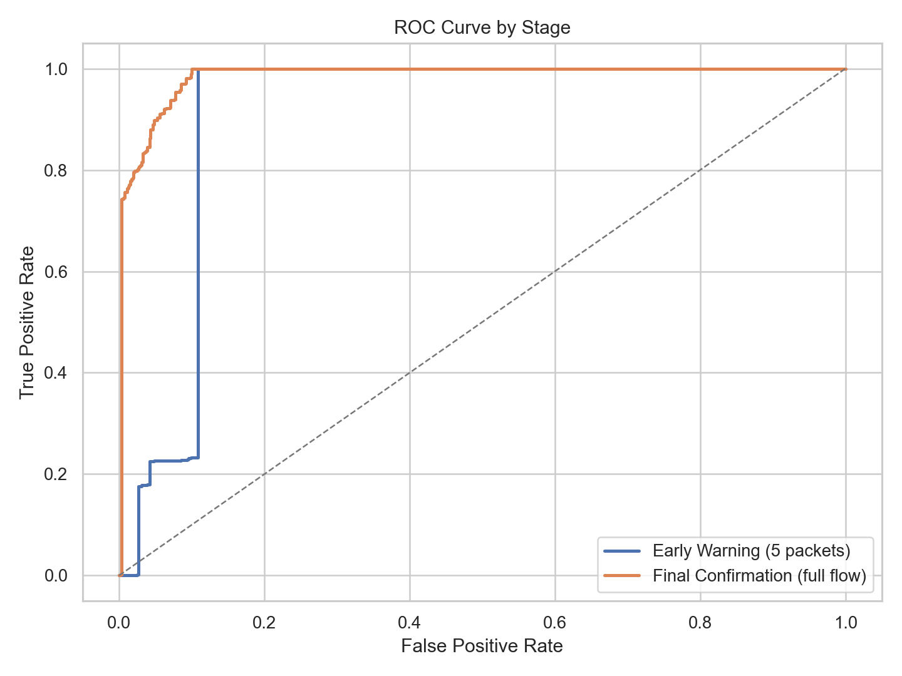
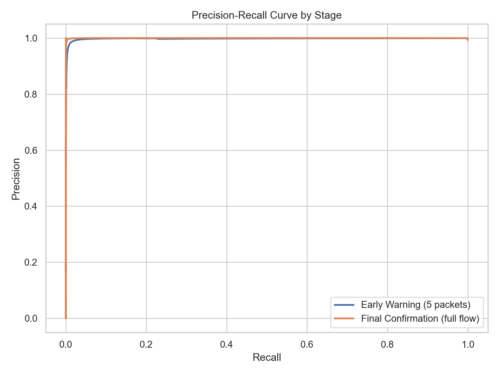
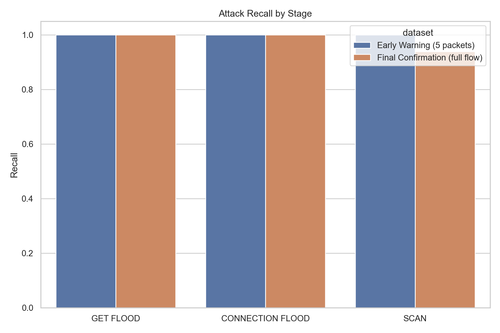
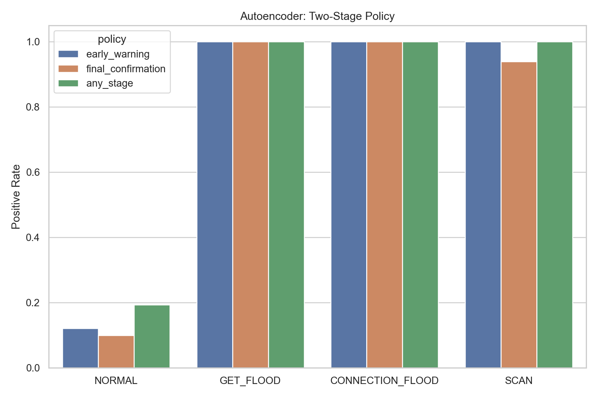
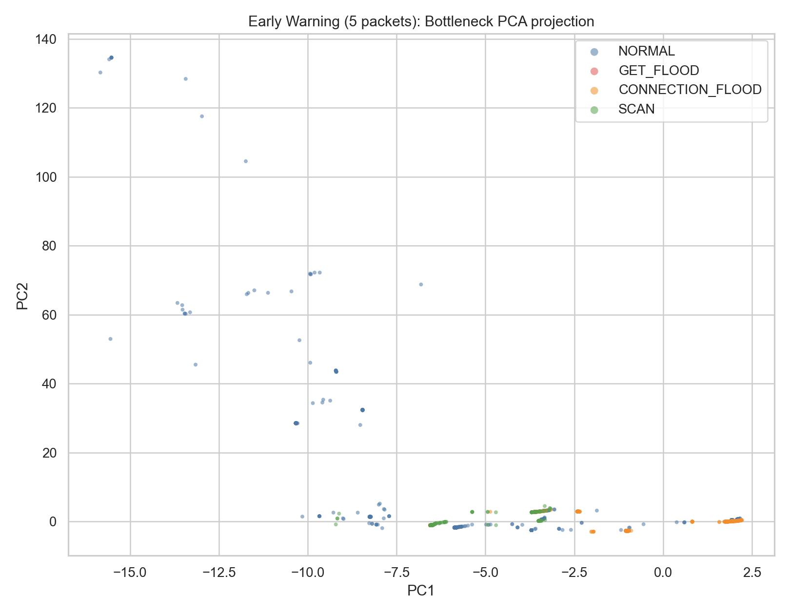
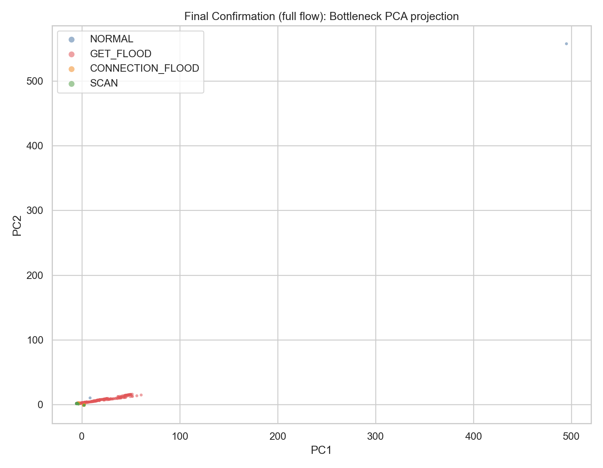

# Autoencoder 결과

## 방법

Autoencoder는 정상 트래픽을 복원하도록 학습된 작은 MLP이며, 복원 오차가 큰 샘플을 이상으로 간주한다.

## 테스트 성능

### 초기 경보 (`merged_5.csv`)

- ROC-AUC: `0.9098`
- PR-AUC: `0.9975`
- 정밀도: `0.9991`
- 재현율: `1.0000`
- F1: `0.9995`
- 정상 FPR: `0.1204`
- GET_FLOOD 재현율: `1.0000`
- CONNECTION_FLOOD 재현율: `1.0000`
- SCAN 재현율: `1.0000`

### 최종 확인 (`merged_full.csv`)

- ROC-AUC: `0.9851`
- PR-AUC: `0.9997`
- 정밀도: `0.9992`
- 재현율: `0.9908`
- F1: `0.9950`
- 정상 FPR: `0.1002`
- GET_FLOOD 재현율: `1.0000`
- CONNECTION_FLOOD 재현율: `1.0000`
- SCAN 재현율: `0.9391`

## 2단계 정책

- `초기 경보`
  - 정밀도: `0.9991`
  - 재현율: `1.0000`
  - F1: `0.9995`
  - 정상 FPR: `0.1204`
- `최종 확인`
  - 정밀도: `0.9992`
  - 재현율: `0.9908`
  - F1: `0.9950`
  - 정상 FPR: `0.0988`
- `하나라도 탐지`
  - 정밀도: `0.9985`
  - 재현율: `1.0000`
  - F1: `0.9993`
  - 정상 FPR: `0.1929`

## 해석

- 초기 단계 재현율이 full 단계보다 높아서, 5패킷 모델이 더 공격적인 탐지기로 동작한다.
- 최종 단계에서 가장 어려운 공격은 `SCAN`이며, 세 공격군 중 재현율이 가장 낮다.
- OR 형태의 2단계 정책은 재현율을 높이지만 정상 오탐도 함께 증가하므로 threshold 조정이 중요하다.

## 시각화

## 잠재공간 시각화

별도 문서:

- [Autoencoder 잠재공간 시각화](./anomaly-autoencoder-latent.md)

대표 plot:

3D plot:

- [5패킷 PCA 3D HTML](../prediction/anomaly_benchmark/autoencoder/5/latent_pca_3d.html)
- [전체 flow PCA 3D HTML](../prediction/anomaly_benchmark/autoencoder/full/latent_pca_3d.html)

## 산출물

- `prediction/anomaly_benchmark/autoencoder/model_results.csv`
- `prediction/anomaly_benchmark/autoencoder/two_stage_policy_metrics.csv`
- `prediction/anomaly_benchmark/autoencoder/summary.json`
