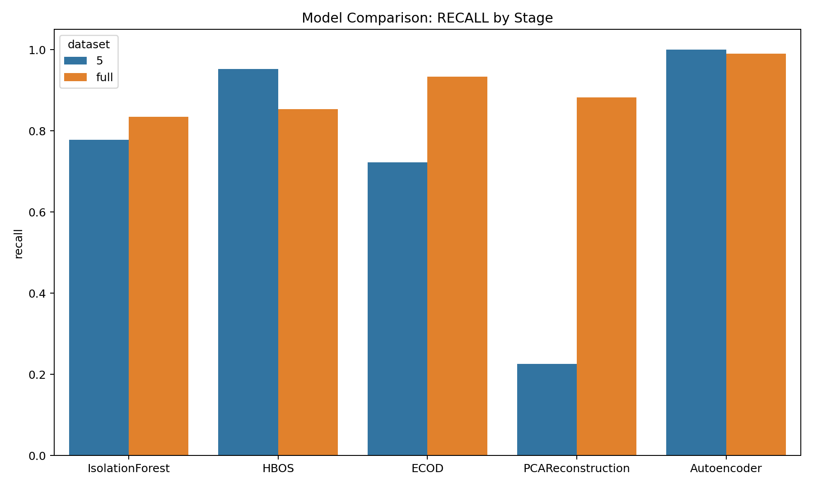
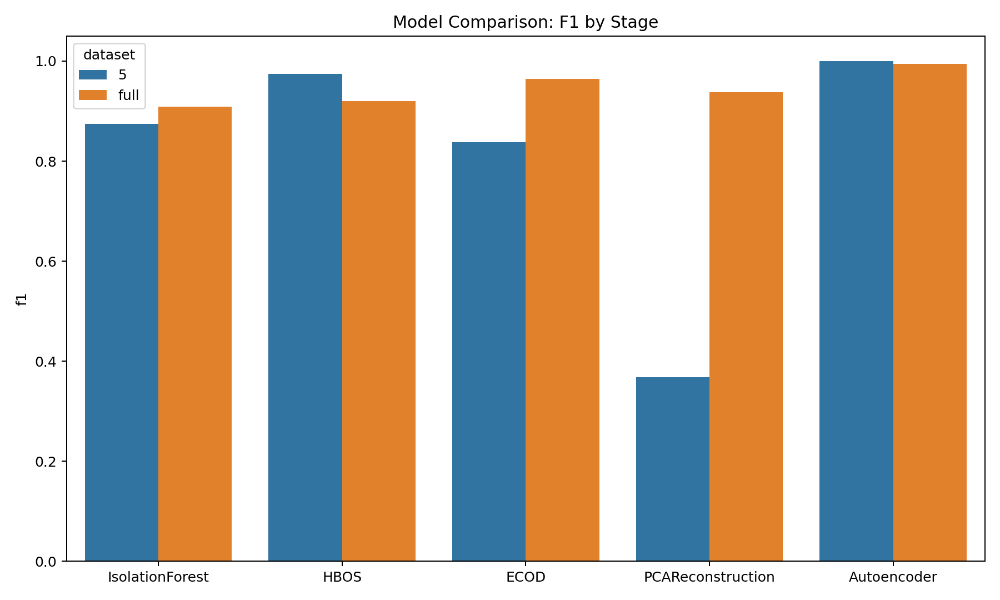
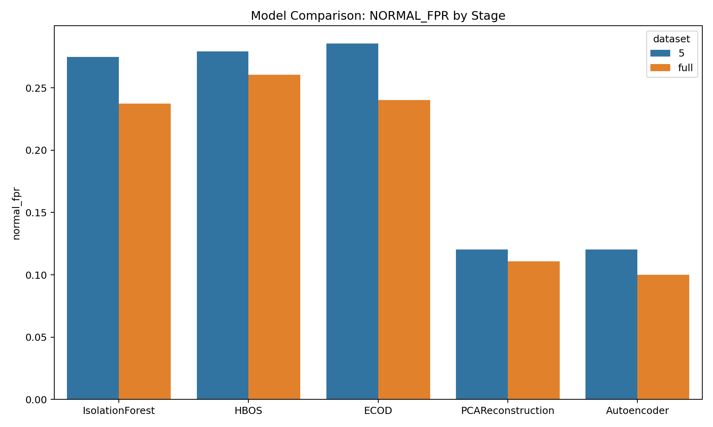
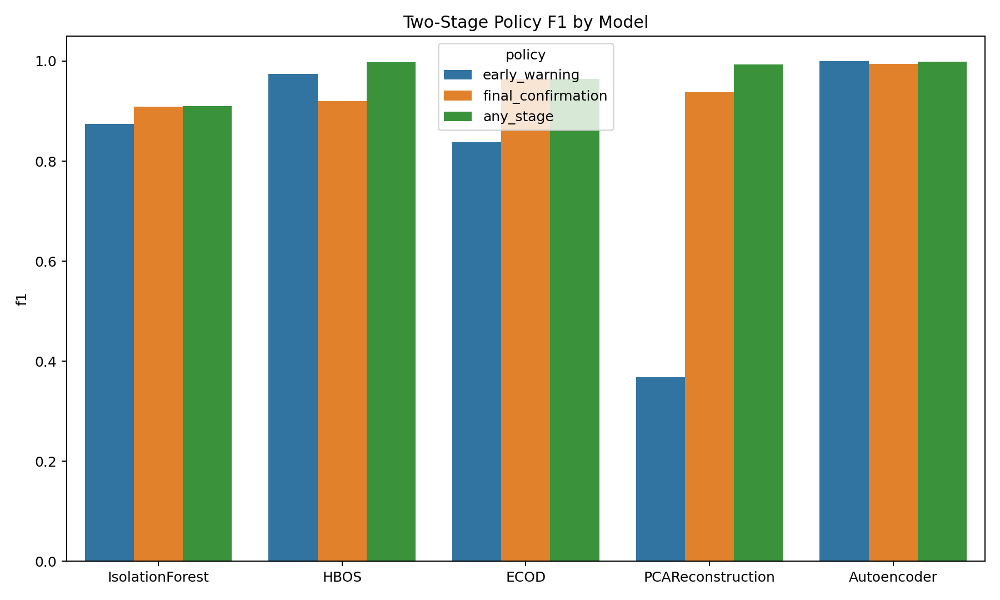

# 표 형식 이상 탐지 벤치마크 비교

## 실험 설정

- 데이터: `merged_5.csv`, `merged_full.csv`
- 학습 분할: `NORMAL`만 사용
- 검증/테스트 분할: `NORMAL + ABNORMAL`
- 분할 단위: `source_file`
- threshold 정책:
  - 초기 단계: `normal FPR <= 10%` 조건에서 이상 재현율 최대화
  - 최종 단계: validation에서 `normal FPR <= 5%` 조건으로 F1 최대화

## 핵심 결과

- 초기 단계 최고 재현율: `Autoencoder` / 재현율 `1.0000` / 정상 FPR `0.1204`
- 최종 단계 최고 F1: `Autoencoder` / F1 `0.9950` / 정상 FPR `0.1002`
- 최종 단계 최저 정상 FPR: `Autoencoder` / 정상 FPR `0.1002` / F1 `0.9950`

## 해석

- `Autoencoder`가 전체적으로 가장 강했다. 초기 단계 재현율과 최종 단계 F1 모두 우세하지만, 정상 FPR이 약 10% 수준이라 운영용으로는 threshold 재조정이 필요하다.
- `HBOS`는 가벼운 고전적 baseline으로는 괜찮지만, 정상 오탐이 높고 full 단계에서 SCAN 재현율이 크게 무너진다.
- `ECOD`는 초기 단계에서는 약하고 full 단계에서 강해진다. 조기 탐지기보다 보수적인 최종 확인기 성격에 가깝다.
- `PCA reconstruction`은 초기 경보 성능은 약하지만 full flow가 주어지면 경쟁력이 생긴다. 공격 유형별 편차가 커서 초기 모델보다는 full baseline으로 보는 편이 맞다.
- `IsolationForest`는 이번 데이터에서는 다섯 방법 중 가장 약했다. 주력 후보보다는 참조 baseline으로 보는 편이 적절하다.

## 권장 사항

- 목표가 false negative 최소화라면 `merged_5.csv` 기준 `Autoencoder`부터 시작하고, 이후 정상 FPR을 줄이는 방향으로 threshold를 다시 잡는 것이 좋다.
- 논문용 고전 baseline은 `HBOS`, `ECOD`, `PCA reconstruction`을 중심으로 두는 것이 적절하다.
- `Autoencoder`가 고전 모델보다 많이 강하므로, 다음 단계에서는 unseen capture/session 또는 더 강한 홀드아웃 환경에서 일반화 성능을 다시 검증해야 한다.

## 테스트 비교 표

| 데이터셋   | 단계              | 목적   | 분할   | 모델                |   ROC-AUC |   PR-AUC |   threshold |      정밀도 |      재현율 |       F1 |   정상 FPR |   이상 재현율 |   GET_FLOOD 재현율 |   CONNECTION_FLOOD 재현율 |    SCAN 재현율 | slug               |
|:-------|:----------------|:-----|:-----|:------------------|----------:|---------:|------------:|---------:|---------:|---------:|---------:|---------:|----------------:|-----------------------:|------------:|:-------------------|
| 5      | 초기 경보 (5패킷)     | 초기   | test | IsolationForest   |  0.713226 | 0.990277 |   0.481291  | 0.997344 | 0.77788  | 0.874046 | 0.274691 | 0.77788  |       0.0316547 |              0.932222  | 0.00815698  | isolation_forest   |
| full   | 최종 확인 (전체 flow) | 최종   | test | IsolationForest   |  0.822552 | 0.996486 |   0.497781  | 0.997857 | 0.8348   | 0.909075 | 0.237288 | 0.8348   |       0.235971  |              0.997875  | 0.00130809  | isolation_forest   |
| 5      | 초기 경보 (5패킷)     | 초기   | test | HBOS              |  0.730417 | 0.994647 |  83.2069    | 0.997794 | 0.952824 | 0.974791 | 0.279321 | 0.952824 |       0.792086  |              0.948663  | 0.99292     | hbos               |
| full   | 최종 확인 (전체 flow) | 최종   | test | HBOS              |  0.791974 | 0.992809 | 106.335     | 0.997702 | 0.853994 | 0.920271 | 0.260401 | 0.853994 |       0.543165  |              0.999077  | 0.0887196   | hbos               |
| 5      | 초기 경보 (5패킷)     | 초기   | test | ECOD              |  0.677586 | 0.987106 | 104.911     | 0.997027 | 0.722231 | 0.837668 | 0.285494 | 0.722231 |       0.0100719 |              0.867157  | 0.000692574 | ecod               |
| full   | 최종 확인 (전체 flow) | 최종   | test | ECOD              |  0.882055 | 0.99645  | 126.101     | 0.998059 | 0.933492 | 0.964696 | 0.24037  | 0.933492 |       0.495683  |              0.999916  | 0.614728    | ecod               |
| 5      | 초기 경보 (5패킷)     | 초기   | test | PCAReconstruction |  0.804333 | 0.993366 |   0.0717384 | 0.995994 | 0.225717 | 0.368029 | 0.12037  | 0.225717 |       0.985612  |              0.0711749 | 0.995075    | pca_reconstruction |
| full   | 최종 확인 (전체 flow) | 최종   | test | PCAReconstruction |  0.971376 | 0.999584 |   0.0662805 | 0.999052 | 0.882778 | 0.937323 | 0.11094  | 0.882778 |       0.947482  |              0.981783  | 0.330948    | pca_reconstruction |
| 5      | 초기 경보 (5패킷)     | 초기   | test | Autoencoder       |  0.909844 | 0.997466 |   0.0065325 | 0.999093 | 1        | 0.999546 | 0.12037  | 1        |       1         |              1         | 1           | autoencoder        |
| full   | 최종 확인 (전체 flow) | 최종   | test | Autoencoder       |  0.985079 | 0.9997   |   0.0281577 | 0.999237 | 0.990758 | 0.99498  | 0.100154 | 0.990758 |       1         |              0.999958  | 0.939135    | autoencoder        |

## 2단계 정책 비교 표

| 모델                | 정책      |      정밀도 |      재현율 |       F1 |    정상 FPR | slug               |
|:------------------|:--------|---------:|---------:|---------:|----------:|:-------------------|
| IsolationForest   | 초기 경보   | 0.997344 | 0.77788  | 0.874046 | 0.274691  | isolation_forest   |
| IsolationForest   | 최종 확인   | 0.997857 | 0.834798 | 0.909074 | 0.237654  | isolation_forest   |
| IsolationForest   | 하나라도 탐지 | 0.996907 | 0.836579 | 0.909733 | 0.344136  | isolation_forest   |
| HBOS              | 초기 경보   | 0.997794 | 0.952824 | 0.974791 | 0.279321  | hbos               |
| HBOS              | 최종 확인   | 0.997715 | 0.853992 | 0.920276 | 0.259259  | hbos               |
| HBOS              | 하나라도 탐지 | 0.997441 | 0.997928 | 0.997684 | 0.339506  | hbos               |
| ECOD              | 초기 경보   | 0.997027 | 0.722231 | 0.837668 | 0.285494  | ecod               |
| ECOD              | 최종 확인   | 0.998071 | 0.933491 | 0.964701 | 0.239198  | ecod               |
| ECOD              | 하나라도 탐지 | 0.9975   | 0.933607 | 0.964497 | 0.310185  | ecod               |
| PCAReconstruction | 초기 경보   | 0.995994 | 0.225717 | 0.368029 | 0.12037   | pca_reconstruction |
| PCAReconstruction | 최종 확인   | 0.999065 | 0.882777 | 0.937328 | 0.109568  | pca_reconstruction |
| PCAReconstruction | 하나라도 탐지 | 0.998589 | 0.988279 | 0.993407 | 0.185185  | pca_reconstruction |
| Autoencoder       | 초기 경보   | 0.999093 | 1        | 0.999546 | 0.12037   | autoencoder        |
| Autoencoder       | 최종 확인   | 0.999249 | 0.990758 | 0.994985 | 0.0987654 | autoencoder        |
| Autoencoder       | 하나라도 탐지 | 0.998547 | 1        | 0.999273 | 0.192901  | autoencoder        |

## 시각화

## 개별 문서

- [Isolation Forest](./anomaly-isolation-forest.md)
- [HBOS](./anomaly-hbos.md)
- [ECOD](./anomaly-ecod.md)
- [PCA Reconstruction](./anomaly-pca-reconstruction.md)
- [Autoencoder](./anomaly-autoencoder.md)

