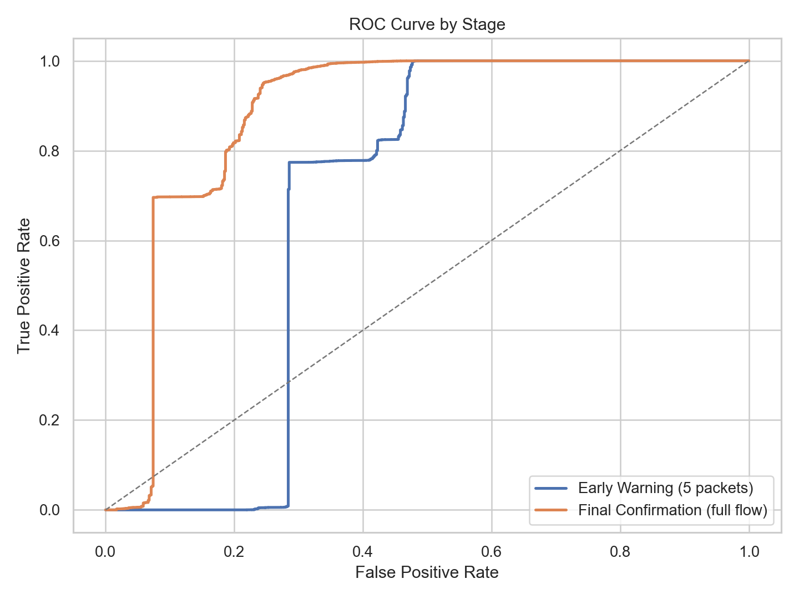
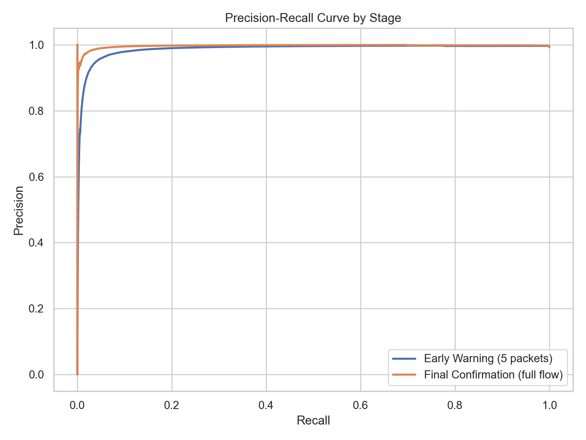
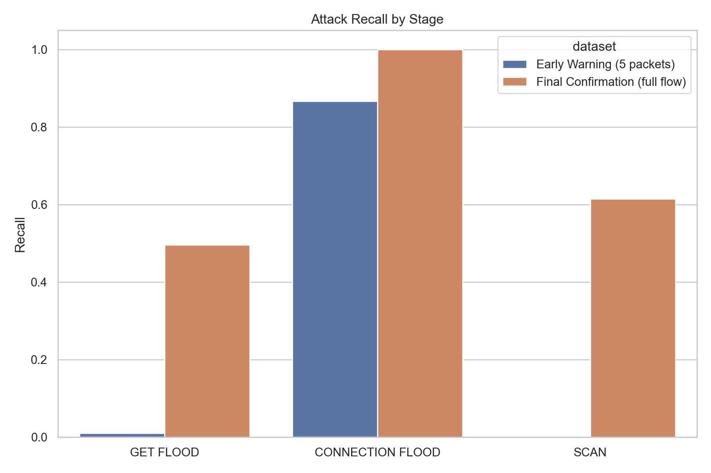
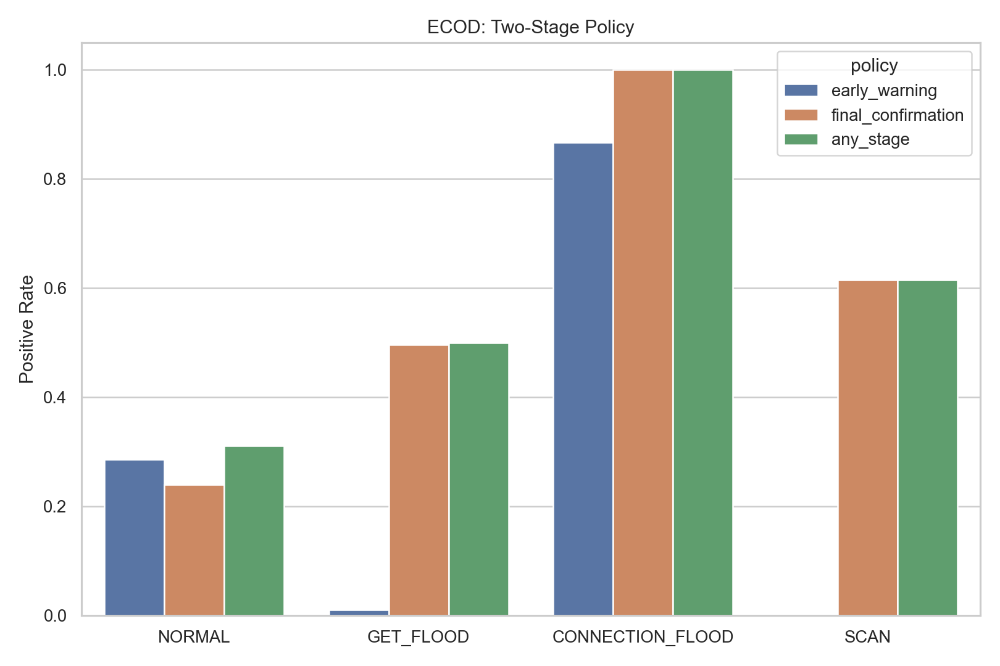

# ECOD 결과

## 방법

ECOD는 empirical CDF의 꼬리 확률을 이용하며, 하나 이상의 feature에서 극단 꼬리 구간에 위치한 샘플에 높은 이상 점수를 준다.

## 테스트 성능

### 초기 경보 (`merged_5.csv`)

- ROC-AUC: `0.6776`
- PR-AUC: `0.9871`
- 정밀도: `0.9970`
- 재현율: `0.7222`
- F1: `0.8377`
- 정상 FPR: `0.2855`
- GET_FLOOD 재현율: `0.0101`
- CONNECTION_FLOOD 재현율: `0.8672`
- SCAN 재현율: `0.0007`

### 최종 확인 (`merged_full.csv`)

- ROC-AUC: `0.8821`
- PR-AUC: `0.9964`
- 정밀도: `0.9981`
- 재현율: `0.9335`
- F1: `0.9647`
- 정상 FPR: `0.2404`
- GET_FLOOD 재현율: `0.4957`
- CONNECTION_FLOOD 재현율: `0.9999`
- SCAN 재현율: `0.6147`

## 2단계 정책

- `초기 경보`
  - 정밀도: `0.9970`
  - 재현율: `0.7222`
  - F1: `0.8377`
  - 정상 FPR: `0.2855`
- `최종 확인`
  - 정밀도: `0.9981`
  - 재현율: `0.9335`
  - F1: `0.9647`
  - 정상 FPR: `0.2392`
- `하나라도 탐지`
  - 정밀도: `0.9975`
  - 재현율: `0.9336`
  - F1: `0.9645`
  - 정상 FPR: `0.3102`

## 해석

- full 단계 재현율이 초기 단계와 같거나 더 높아서, 더 긴 flow 정보가 유의미한 확인 신호를 추가하고 있다.
- 최종 단계에서 가장 어려운 공격은 `GET_FLOOD`이며, 세 공격군 중 재현율이 가장 낮다.
- OR 형태의 2단계 정책은 재현율을 높이지만 정상 오탐도 함께 증가하므로 threshold 조정이 중요하다.

## 시각화

## 산출물

- `prediction/anomaly_benchmark/ecod/model_results.csv`
- `prediction/anomaly_benchmark/ecod/two_stage_policy_metrics.csv`
- `prediction/anomaly_benchmark/ecod/summary.json`
