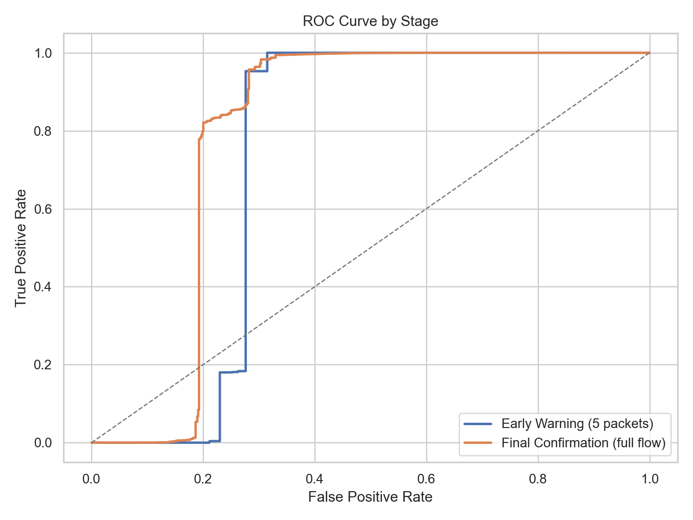
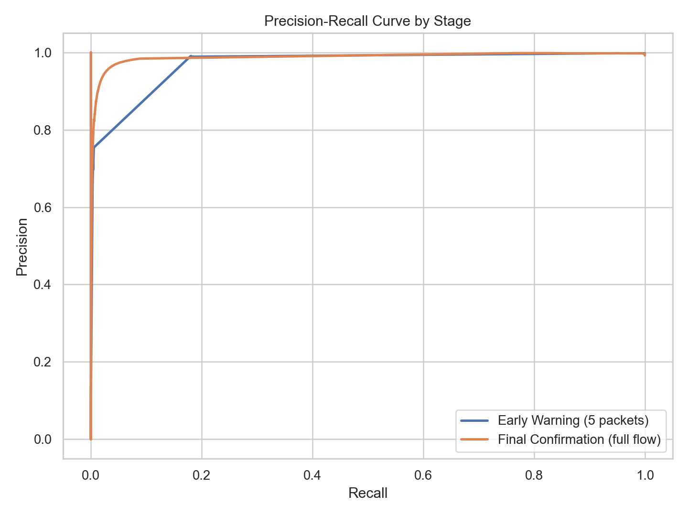
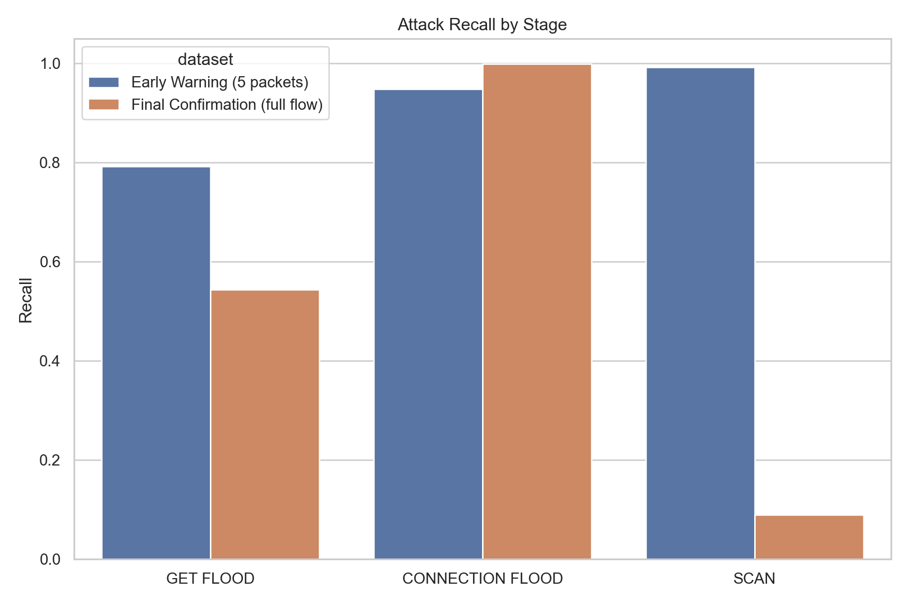
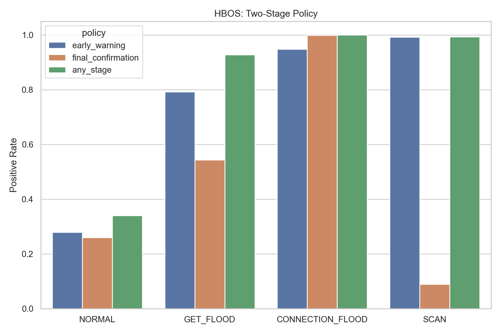

# HBOS 결과

## 방법

HBOS는 각 feature를 독립적인 histogram으로 모델링하고, 밀도가 낮은 bin에 들어가는 샘플에 더 큰 이상 점수를 부여한다.

## 테스트 성능

### 초기 경보 (`merged_5.csv`)

- ROC-AUC: `0.7304`
- PR-AUC: `0.9946`
- 정밀도: `0.9978`
- 재현율: `0.9528`
- F1: `0.9748`
- 정상 FPR: `0.2793`
- GET_FLOOD 재현율: `0.7921`
- CONNECTION_FLOOD 재현율: `0.9487`
- SCAN 재현율: `0.9929`

### 최종 확인 (`merged_full.csv`)

- ROC-AUC: `0.7920`
- PR-AUC: `0.9928`
- 정밀도: `0.9977`
- 재현율: `0.8540`
- F1: `0.9203`
- 정상 FPR: `0.2604`
- GET_FLOOD 재현율: `0.5432`
- CONNECTION_FLOOD 재현율: `0.9991`
- SCAN 재현율: `0.0887`

## 2단계 정책

- `초기 경보`
  - 정밀도: `0.9978`
  - 재현율: `0.9528`
  - F1: `0.9748`
  - 정상 FPR: `0.2793`
- `최종 확인`
  - 정밀도: `0.9977`
  - 재현율: `0.8540`
  - F1: `0.9203`
  - 정상 FPR: `0.2593`
- `하나라도 탐지`
  - 정밀도: `0.9974`
  - 재현율: `0.9979`
  - F1: `0.9977`
  - 정상 FPR: `0.3395`

## 해석

- 초기 단계 재현율이 full 단계보다 높아서, 5패킷 모델이 더 공격적인 탐지기로 동작한다.
- 최종 단계에서 가장 어려운 공격은 `SCAN`이며, 세 공격군 중 재현율이 가장 낮다.
- OR 형태의 2단계 정책은 재현율을 높이지만 정상 오탐도 함께 증가하므로 threshold 조정이 중요하다.

## 시각화

## 산출물

- `prediction/anomaly_benchmark/hbos/model_results.csv`
- `prediction/anomaly_benchmark/hbos/two_stage_policy_metrics.csv`
- `prediction/anomaly_benchmark/hbos/summary.json`
