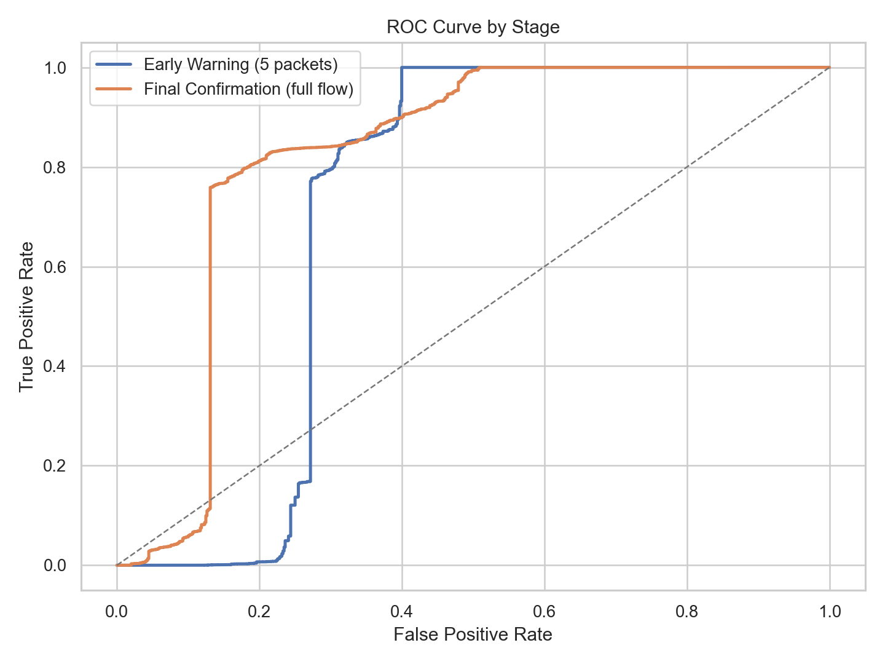
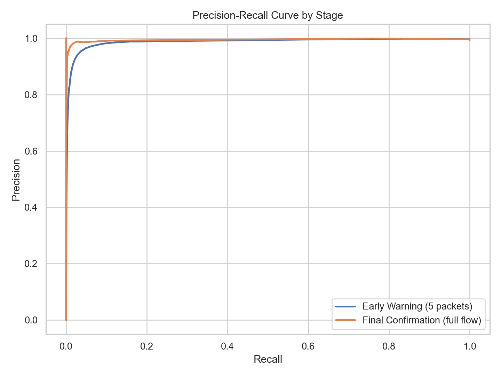
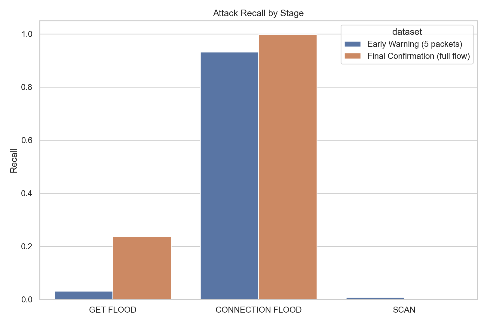
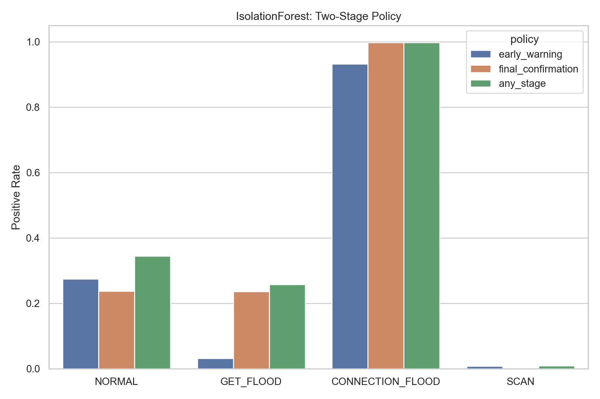

# IsolationForest 결과

## 방법

Isolation Forest는 특징 공간을 재귀적으로 분할하면서 이상치를 분리한다. 더 적은 분할로 쉽게 고립되는 샘플일수록 높은 이상 점수를 받는다.

## 테스트 성능

### 초기 경보 (`merged_5.csv`)

- ROC-AUC: `0.7132`
- PR-AUC: `0.9903`
- 정밀도: `0.9973`
- 재현율: `0.7779`
- F1: `0.8740`
- 정상 FPR: `0.2747`
- GET_FLOOD 재현율: `0.0317`
- CONNECTION_FLOOD 재현율: `0.9322`
- SCAN 재현율: `0.0082`

### 최종 확인 (`merged_full.csv`)

- ROC-AUC: `0.8226`
- PR-AUC: `0.9965`
- 정밀도: `0.9979`
- 재현율: `0.8348`
- F1: `0.9091`
- 정상 FPR: `0.2373`
- GET_FLOOD 재현율: `0.2360`
- CONNECTION_FLOOD 재현율: `0.9979`
- SCAN 재현율: `0.0013`

## 2단계 정책

- `초기 경보`
  - 정밀도: `0.9973`
  - 재현율: `0.7779`
  - F1: `0.8740`
  - 정상 FPR: `0.2747`
- `최종 확인`
  - 정밀도: `0.9979`
  - 재현율: `0.8348`
  - F1: `0.9091`
  - 정상 FPR: `0.2377`
- `하나라도 탐지`
  - 정밀도: `0.9969`
  - 재현율: `0.8366`
  - F1: `0.9097`
  - 정상 FPR: `0.3441`

## 해석

- full 단계 재현율이 초기 단계와 같거나 더 높아서, 더 긴 flow 정보가 유의미한 확인 신호를 추가하고 있다.
- 최종 단계에서 가장 어려운 공격은 `SCAN`이며, 세 공격군 중 재현율이 가장 낮다.
- OR 형태의 2단계 정책은 재현율을 높이지만 정상 오탐도 함께 증가하므로 threshold 조정이 중요하다.

## 시각화

## 산출물

- `prediction/anomaly_benchmark/isolation_forest/model_results.csv`
- `prediction/anomaly_benchmark/isolation_forest/two_stage_policy_metrics.csv`
- `prediction/anomaly_benchmark/isolation_forest/summary.json`
