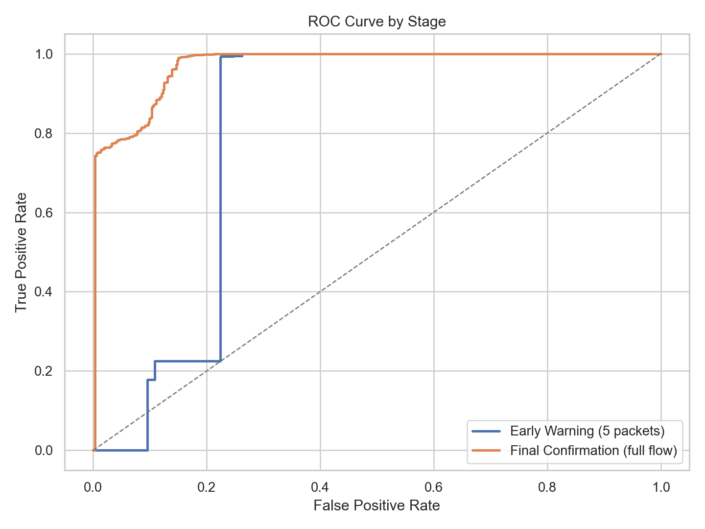
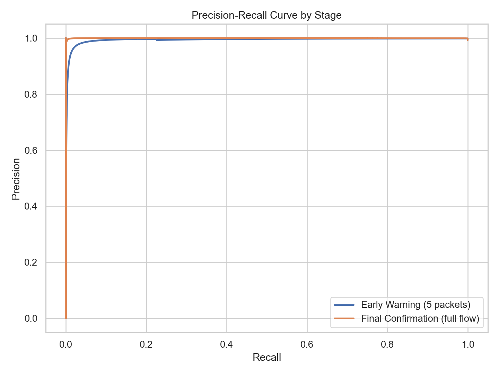
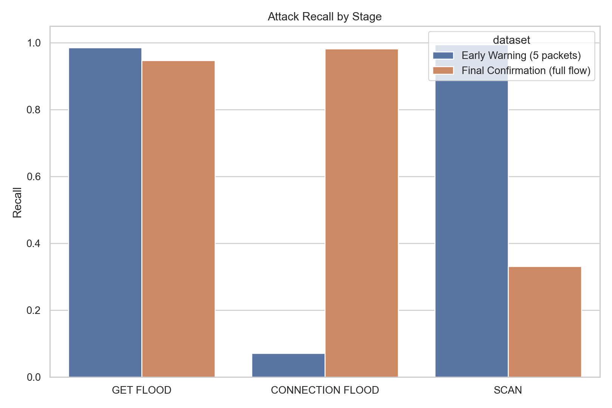
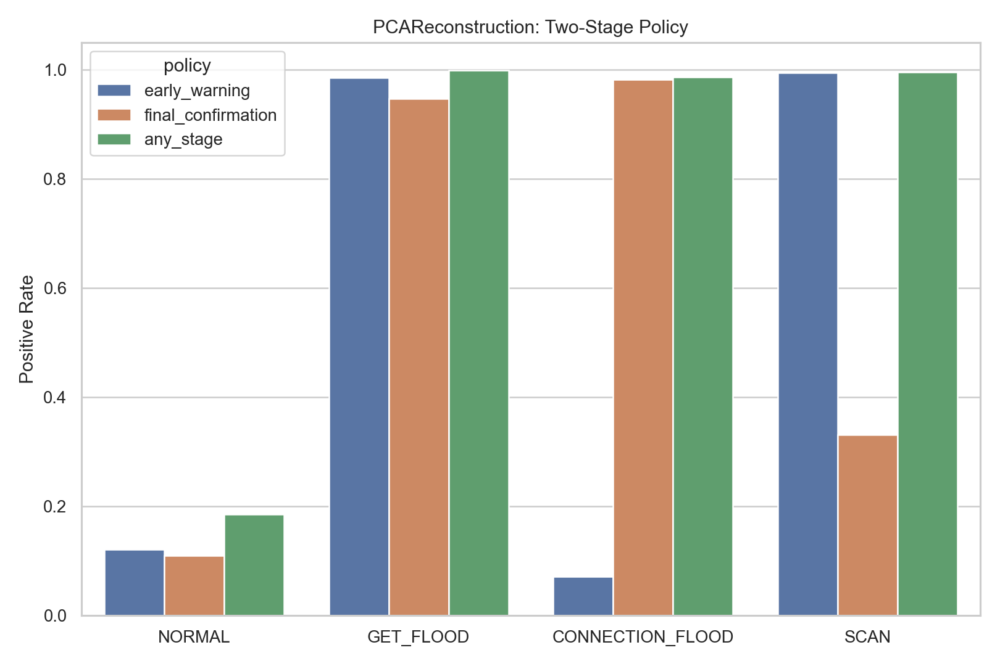

# PCAReconstruction 결과

## 방법

PCA reconstruction은 정상 트래픽으로부터 저차원 부분공간을 학습하고, 복원 오차를 이상 점수로 사용한다.

## 테스트 성능

### 초기 경보 (`merged_5.csv`)

- ROC-AUC: `0.8043`
- PR-AUC: `0.9934`
- 정밀도: `0.9960`
- 재현율: `0.2257`
- F1: `0.3680`
- 정상 FPR: `0.1204`
- GET_FLOOD 재현율: `0.9856`
- CONNECTION_FLOOD 재현율: `0.0712`
- SCAN 재현율: `0.9951`

### 최종 확인 (`merged_full.csv`)

- ROC-AUC: `0.9714`
- PR-AUC: `0.9996`
- 정밀도: `0.9991`
- 재현율: `0.8828`
- F1: `0.9373`
- 정상 FPR: `0.1109`
- GET_FLOOD 재현율: `0.9475`
- CONNECTION_FLOOD 재현율: `0.9818`
- SCAN 재현율: `0.3309`

## 2단계 정책

- `초기 경보`
  - 정밀도: `0.9960`
  - 재현율: `0.2257`
  - F1: `0.3680`
  - 정상 FPR: `0.1204`
- `최종 확인`
  - 정밀도: `0.9991`
  - 재현율: `0.8828`
  - F1: `0.9373`
  - 정상 FPR: `0.1096`
- `하나라도 탐지`
  - 정밀도: `0.9986`
  - 재현율: `0.9883`
  - F1: `0.9934`
  - 정상 FPR: `0.1852`

## 해석

- full 단계 재현율이 초기 단계와 같거나 더 높아서, 더 긴 flow 정보가 유의미한 확인 신호를 추가하고 있다.
- 최종 단계에서 가장 어려운 공격은 `SCAN`이며, 세 공격군 중 재현율이 가장 낮다.
- OR 형태의 2단계 정책은 재현율을 높이지만 정상 오탐도 함께 증가하므로 threshold 조정이 중요하다.

## 시각화

## 산출물

- `prediction/anomaly_benchmark/pca_reconstruction/model_results.csv`
- `prediction/anomaly_benchmark/pca_reconstruction/two_stage_policy_metrics.csv`
- `prediction/anomaly_benchmark/pca_reconstruction/summary.json`
